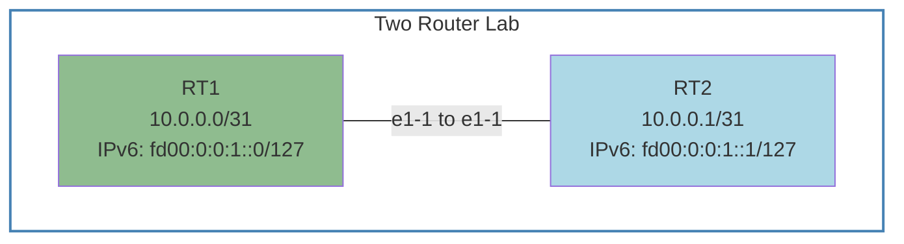

# Building a Network Automation Lab: Containerlab + NetBox on macOS

*Building a foundation for network automation testing and development on a Mac from 2018*

## The Challenge

I needed a reliable local lab environment for testing network automation scripts and prototyping configurations. My 2018 MacBook Pro with 16GB RAM isn't exactly cutting-edge anymore, so I had to be smart about how I used my resources.

My goal was to build something that could handle real routing protocols and integrate with modern automation tools, but wouldn't require enterprise hardware or cloud resources.

## Why Containerlab and NetBox?

After looking at options, I settled on Containerlab for the network simulation and NetBox as my source of truth.

**Containerlab** gives me actual Nokia SR Linux containers instead of simulated devices. The containers use way less memory than VMs but still run real network operating systems. Plus the topology files are just YAML, so I can version control the entire lab setup. 

**NetBox** has become one of the standard applications for network source of truth. It has a solid REST API for automation integration and understands how network devices connect to each other. Since I eventually want to build automation that pulls device info from NetBox and pushes configs, having it in my lab was essential.

## What I Built

I decided on a simple two router topology using Nokia SR Linux routers:



This setup gives me:

- Two Nokia SR Linux routers with direct connectivity
- IPv4 using 10.0.0.0/31
- IPv6 using fd00:: unique local addresses
- A simple but realistic foundation for automation testing
- Easy connectivity verification with ping tests

The setup includes NetBox running alongside the containerlab network, all managed through OrbStack. I'll use NetBox more in later posts. 

## Step 1: Install OrbStack

Containerlab docs suggest running on Linux in Mac, and even suggest OrbStack to accomplish it. Install OrbStack which provides both a Linux environment and Docker engine in one lightweight package. This replaces the need for Docker Desktop entirely.

```bash
# Install OrbStack via Homebrew
brew install orbstack

# Start OrbStack
open -a OrbStack
```

Set your OrbStack to allow it to use 10GB of memory as max to ensure you have enough space for the lab. 

Create an Ubuntu environment for the lab:

```bash
# Create and start an Ubuntu machine
orb create ubuntu clab

# Connect to the machine
orb shell
```

Install docker into the Orb Shell:

```bash
# Install Docker
curl -fsSL https://get.docker.com -o get-docker.sh
sudo sh get-docker.sh

# Add user to docker group to avoid needing sudo
sudo usermod -aG docker $USER

# May need to exit and re-enter the shell for group changes to take effect
exit
orb shell

# Verify docker works
docker --version
```

## Step 2: Install Containerlab

Inside the Ubuntu environment, install containerlab:

```bash
# Install containerlab and dependencies
curl -sL https://containerlab.dev/setup | sudo -E bash -s "all"

# Verify it worked
containerlab version
```

You'll know you have installed it correctly when Containerlab responds with a version:

```bash
$ containerlab version
  ____ ___  _   _ _____  _    ___ _   _ _____ ____  _       _
 / ___/ _ \| \ | |_   _|/ \  |_ _| \ | | ____|  _ \| | __ _| |__
| |  | | | |  \| | | | / _ \  | ||  \| |  _| | |_) | |/ _` | '_ \
| |__| |_| | |\  | | |/ ___ \ | || |\  | |___|  _ <| | (_| | |_) |
 \____\___/|_| \_| |_/_/   \_\___|_| \_|_____|_| \_\_|\__,_|_.__/

    version: 0.69.3
     commit: 49ee599b
       date: 2025-08-06T21:02:24Z
     source: https://github.com/srl-labs/containerlab
 rel. notes: https://containerlab.dev/rn/0.69/#0693
```

## Step 3: Create Lab Directory Structure

Create the lab directory structure. OrbStack makes files easily accessible from both environments. Since you'll be within the directory where you want your lab to exist on your Mac, Orb works similar to a virtual python environment where you're still in that same directory but have access to the linux environment too.

```bash
mkdir network-lab
cd network-lab

# Create subdirectories for organization
mkdir -p topology
```

## Step 4: Define the Network Topology

Create the containerlab topology file that defines the two-router setup. This is based on the proven example from the official containerlab examples.
[See containerlab example here](https://github.com/srl-labs/containerlab/blob/main/lab-examples/srl02)

Create `topology/lab01.yml`:

```yaml
---
name: lab01

topology:
  nodes:
    rt1:
      kind: nokia_srlinux
      image: ghcr.io/nokia/srlinux
      startup-config: rt1.cfg
    rt2:
      kind: nokia_srlinux
      image: ghcr.io/nokia/srlinux
      startup-config: rt2.cfg

  links:
    - endpoints: ["rt1:e1-1", "rt2:e1-1"]
```

This topology creates two Nokia SR Linux containers connected via their e1-1 interfaces.

## Step 5: Create Router Configurations

Create the actual device configs. Base these configurations on the proven configurations from the containerlab examples that work reliably.
[See containerlab example here](https://github.com/srl-labs/containerlab/blob/main/lab-examples/srl02)

[You can find my copies of these config files here on my GitHub.](https://github.com/gereader/containerlab-lab/tree/main/network-lab01)

### RT1 Configuration (`topology/rt1.cfg`)

```
set / interface ethernet-1/1 admin-state enable
set / interface ethernet-1/1 subinterface 0
set / interface ethernet-1/1 subinterface 0 ipv4
set / interface ethernet-1/1 subinterface 0 ipv4 admin-state enable
set / interface ethernet-1/1 subinterface 0 ipv4 address 10.0.0.0/31
set / interface ethernet-1/1 subinterface 0 ipv6
set / interface ethernet-1/1 subinterface 0 ipv6 admin-state enable
set / interface ethernet-1/1 subinterface 0 ipv6 address fd00:0:0:1::0/127

set / network-instance default
set / network-instance default interface ethernet-1/1.0
```

### RT2 Configuration (`topology/rt2.cfg`)

```
set / interface ethernet-1/1 admin-state enable
set / interface ethernet-1/1 subinterface 0
set / interface ethernet-1/1 subinterface 0 ipv4
set / interface ethernet-1/1 subinterface 0 ipv4 admin-state enable
set / interface ethernet-1/1 subinterface 0 ipv4 address 10.0.0.1/31
set / interface ethernet-1/1 subinterface 0 ipv6
set / interface ethernet-1/1 subinterface 0 ipv6 admin-state enable
set / interface ethernet-1/1 subinterface 0 ipv6 address fd00:0:0:1::1/127

set / network-instance default
set / network-instance default interface ethernet-1/1.0
```

## Step 6: Set Up NetBox

NetBox will run in Docker Compose using OrbStack's Docker engine. I am going to use the pre-built version provided by NetBox to make things as simple as possible:

```bash
# Clone the netbox docker repository
git clone -b release https://github.com/netbox-community/netbox-docker.git
cd netbox-docker
```

## Step 7: Deploy Everything

Bring everything up. Everything runs within the OrbStack Ubuntu environment.

### Start NetBox First

```bash
# Make sure you're in the Ubuntu environment
orb shell
cd network-lab/netbox-docker

# Pull and start using netbox's method
docker compose pull

# Setup overrides for our use, this establishes the ports for the website
cat > docker-compose.override.yml << 'EOF'
services:
  netbox:
    ports:
      - "8000:8080"
EOF

# Start the netbox containers
docker compose up -d
```

Check that containers are running with `docker ps`. You can look at their logs through `docker logs <container name>`.

Once the containers are running, set up a superuser for the installation:

```bash
docker compose exec netbox /opt/netbox/netbox/manage.py createsuperuser
```

If you're alerted to migrations being required, run them like this:
```bash
docker compose exec netbox /opt/netbox/netbox/manage.py migrate
```

### Login to NetBox

Verify NetBox is running by logging in via your web browser. Navigate to `127.0.0.1:8000` and you should be prompted to login to NetBox. Use the superuser account created in the previous step. 

### NetBox Data Persistence

NetBox stores data in Docker volumes, so your database, users, and configuration persist between container restarts. If you need to start completely fresh:

```bash
# Stop containers and remove all data (including volumes) use -v
docker compose down -v
```

Then restart with `docker compose up -d` for a clean installation.

### Deploy the Network Lab

Navigate back to the network-lab directory and bring everything online:

```bash
# Deploy the lab topology
sudo containerlab deploy -t topology/lab01.yml

# Check the status
containerlab inspect -t topology/lab01.yml
```

This will pull the Nokia SR Linux images (might take a few minutes the first time) and start the containers.

Expected output:
```bash
$ sudo containerlab deploy -t topology/lab01.yml
15:14:25 INFO Containerlab started version=0.69.3
15:14:25 INFO Parsing & checking topology file=lab01.yml
15:14:25 INFO Creating docker network name=clab IPv4 subnet=172.20.20.0/24 IPv6 subnet=3fff:172:20:20::/64 MTU=1500
15:14:26 INFO Creating lab directory path=/Users/genereader/Code_Projects/clab-intro/network-lab/topology/clab-lab01
15:14:26 INFO unable to adjust Labdir file ACLs: operation not supported
15:14:26 INFO Creating container name=rt2
15:14:26 INFO Creating container name=rt1
15:14:26 INFO Running postdeploy actions kind=nokia_srlinux node=rt2
15:14:26 INFO Created link: rt1:e1-1 ▪┄┄▪ rt2:e1-1
15:14:26 INFO Running postdeploy actions kind=nokia_srlinux node=rt1
15:14:56 INFO Adding host entries path=/etc/hosts
15:14:56 INFO Adding SSH config for nodes path=/etc/ssh/ssh_config.d/clab-lab01.conf
🎉 A newer containerlab version (0.70.2) is available!
Release notes: https://containerlab.dev/rn/0.70/#0702
Run 'sudo clab version upgrade' or see https://containerlab.dev/install/ for installation options.
╭────────────────┬───────────────────────┬─────────┬───────────────────╮
│      Name      │       Kind/Image      │  State  │   IPv4/6 Address  │
├────────────────┼───────────────────────┼─────────┼───────────────────┤
│ clab-lab01-rt1 │ nokia_srlinux         │ running │ 172.20.20.3       │
│                │ ghcr.io/nokia/srlinux │         │ 3fff:172:20:20::3 │
├────────────────┼───────────────────────┼─────────┼───────────────────┤
│ clab-lab01-rt2 │ nokia_srlinux         │ running │ 172.20.20.2       │
│                │ ghcr.io/nokia/srlinux │         │ 3fff:172:20:20::2 │
╰────────────────┴───────────────────────┴─────────┴───────────────────╯
```

## Step 8: Verify Everything Works

### Test the Network

SSH into the routers and verify connectivity using ping:

```bash 
# Connect to RT1
ssh admin@clab-lab01-rt1

# Check interface status
show interface ethernet-1/1

# Test IPv4 connectivity to RT2
ping 10.0.0.1 network-instance default

# Test IPv6 connectivity to RT2  
ping fd00:0:0:1::1 network-instance default

# Example output
A:admin@rt1# ping 10.0.0.1 network-instance default
Using network instance default
PING 10.0.0.1 (10.0.0.1) 56(84) bytes of data.
64 bytes from 10.0.0.1: icmp_seq=1 ttl=64 time=54.1 ms
64 bytes from 10.0.0.1: icmp_seq=2 ttl=64 time=1.91 ms
64 bytes from 10.0.0.1: icmp_seq=3 ttl=64 time=1.78 ms

A:admin@rt1# ping fd00:0:0:1::1 network-instance default
Using network instance default
PING fd00:0:0:1::1(fd00:0:0:1::1) 56 data bytes
64 bytes from fd00:0:0:1::1: icmp_seq=1 ttl=64 time=14.2 ms
64 bytes from fd00:0:0:1::1: icmp_seq=2 ttl=64 time=3.01 ms
64 bytes from fd00:0:0:1::1: icmp_seq=3 ttl=64 time=2.89 ms
```

Repeat the same test from RT2:

```bash
# Connect to RT2
ssh admin@clab-lab01-rt2

# Check interface status
show interface ethernet-1/1

# Test IPv4 connectivity to RT1
ping 10.0.0.0 network-instance default

# Test IPv6 connectivity to RT1  
ping fd00:0:0:1:: network-instance default

# Example output
A:admin@rt2# ping 10.0.0.0 network-instance default
Using network instance default
PING 10.0.0.0 (10.0.0.0) 56(84) bytes of data.
64 bytes from 10.0.0.0: icmp_seq=1 ttl=64 time=4.57 ms
64 bytes from 10.0.0.0: icmp_seq=2 ttl=64 time=3.46 ms
64 bytes from 10.0.0.0: icmp_seq=3 ttl=64 time=2.39 ms
64 bytes from 10.0.0.0: icmp_seq=4 ttl=64 time=2.95 ms
64 bytes from 10.0.0.0: icmp_seq=5 ttl=64 time=2.77 ms

A:admin@rt2# ping fd00:0:0:1:: network-instance default
Using network instance default
PING fd00:0:0:1::(fd00:0:0:1::) 56 data bytes
64 bytes from fd00:0:0:1::: icmp_seq=1 ttl=64 time=2.90 ms
64 bytes from fd00:0:0:1::: icmp_seq=2 ttl=64 time=2.40 ms
64 bytes from fd00:0:0:1::: icmp_seq=3 ttl=64 time=1.92 ms
64 bytes from fd00:0:0:1::: icmp_seq=4 ttl=64 time=2.19 ms
64 bytes from fd00:0:0:1::: icmp_seq=5 ttl=64 time=3.06 ms
```

If everything is working correctly, you should see:

- Interface ethernet-1/1 shows as "up" on both devices
- IPv4 pings between 10.0.0.0 and 10.0.0.1 succeed
- IPv6 pings between fd00:0:0:1:: and fd00:0:0:1::1 succeed

### Troubleshooting

I did find that I had to specify the network-instance for the Nokia OS to know how to ping the connected device. By default ping was using the management network-instance. 

## What Actually Happened

After about 1 hour total, I had:
- NetBox running and accessible via OrbStack
- Two Nokia SR Linux routers with working IPv4 and IPv6 connectivity
- A quickly deployable lab environment
- The foundation for building more complex automation scenarios 

Using OrbStack kept everything contained in one lightweight environment while providing both Docker and Linux capabilities.

## Things That Worked Well

- Using OrbStack for everything eliminated the complexity of managing Docker Desktop separately. The resource usage was reasonable, and having everything in one environment made troubleshooting much easier. My computer fans were audible but that's not uncommon when using resources. 
- Starting with the proven two-router example from containerlab documentation ensured I had a working baseline before adding complexity.
- Having NetBox running locally means I can develop automation scripts without needing internet access or worrying about API rate limits.
- The dual-stack IPv4/IPv6 setup provides a realistic modern network environment for testing.

## Next Steps

This foundation enables several automation workflows:
- Populate NetBox with device inventory via API
- Generate configurations from NetBox data using templates
- Deploy configs to devices using Ansible or Python scripts
- Add routing protocols like BGP or OSPF to test convergence scenarios
- Expand to more complex topologies once the automation pipeline is solid

The next post will focus on automating the population of NetBox with device data and using that information to generate and deploy configurations.

## Clean Up

When you're done testing:

```bash
# Stop the network lab
sudo containerlab destroy -t topology/lab01.yml

# Stop NetBox
cd netbox-docker
docker compose down

# Optional: Remove everything including data
docker compose down -v
docker system prune -f
```

---

*Next up: Building automation pipelines that use NetBox as the source of truth for network device management.*