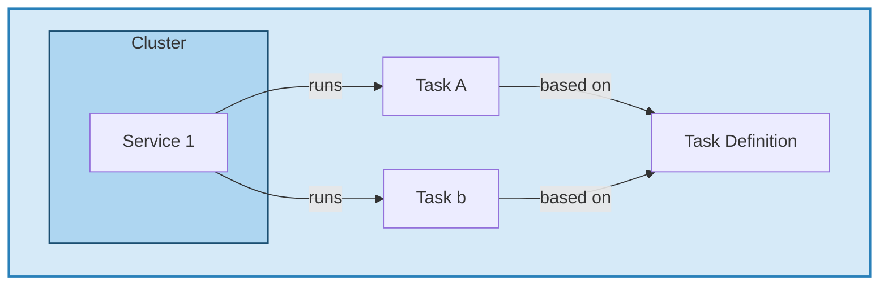

# Deploying to AWS ECS: From Container Registry to Production

In [Part 1](), I built a pipeline that automatically tests my Flask app and pushes containers to both GHCR and ECR. I'm going to deploy those containers somewhere that people can use them. I'm going to use AWS ECS to make my app publicly accessible. (This won't be accessible to the public, I'll be spinning this down after the demo to avoid burning through my AWS credits and racking up costs.) 

Part 2 will take me from having containers sitting in registries to having a live application running in production with automated deployments. I'll set up everything needed for a production-ready deployment while keeping costs as low as possible.

## What I'll accomplish in Part 2
- Set up an ECS cluster optimized for free tier usage
- Create task definitions and services to run my containers
- Extend my GitHub Actions workflow to automatically deploy to ECS
- Implement minimal-downtime deployments
- Monitor my production application and handle common issues

## Why ECS Over Other AWS Options

Before diving into the setup, let me explain why I chose ECS on EC2 over alternatives like Elastic Beanstalk or Fargate.

**ECS on EC2** = Free tier eligible when using t3.micro instances. You only pay for the underlying EC2 resources, and ECS itself doesn't add additional charges for the EC2 launch type.

**Fargate** = Pay per task with no free tier. While Fargate removes infrastructure management, you are charged for the resources that you use.

**Elastic Beanstalk** = Less control over the underlying infrastructure and harder to optimize for costs. It also abstracts away too much, I did this project for learning purposes.

For this project, ECS on EC2 gives me the best balance of cost control, learning opportunities, and production capabilities.

## AWS ECS Architecture Overview

Before I start clicking around the AWS console, let me understand what the components are and how ECS components work together:

- **Cluster**: A logical grouping of EC2 instances where containers run
- **Task Definition**: A "blueprint" that describes how containers should run (like a Docker Compose file)
- **Service**: Manages running tasks, handles deployments, and maintains defined capacity  
- **Tasks**: Individual running instances of your containers based on task definitions



The flow works like this: I create a Task Definition (the blueprint for how my container should run), create a Service that manages how many tasks I want running, and ECS schedules those tasks across my cluster of EC2 instances. In my setup, I'll have one cluster with one service running one task based on one task definition.

## Setting Up ECS Cluster within the Free Tier

The key to staying within free tier is using ECS on EC2 with t3.micro instances. Let me go ahead and create the cluster now. 

I'll start by navigating to the ECS console and clicking "Create Cluster". 

### Cluster Configuration

Here are the specific settings I chose to stay within free tier:

**Cluster Name**: FlaskJobTracker-ExampleCluster

**Infrastructure**:

- Amazon EC2 Instances
- Create new ASG (Auto Scaling Group)
- **Spot** provisioning model (to reduce cost further, this is not ideal for production use cases)
- Instance Type: **t3.micro** (1 minimum, 1 maximum)

I kept many of the default settings as the defaults work for my deployment. 



### Security Group Configuration

The default security group used by ECS will not cover my full use case. I could have created a new one to begin with, but I like to allow the default to be applied in case there are any policies in place to apply specific rules. I need to allow HTTP/s traffic. I quickly created a new security group to cover my access. 

I'll navigate to EC2 → Security Groups and find the security group created for my ECS cluster.

I'll call my security group `Allow-MyIP-Inbound` to have a descriptive name of what the Security Group is doing. 

I'll add this inbound rule:
- **Type**: All Traffic, **Source**: My IP

*I am opening all Traffic for ease, but if you were building this to be deployed full time, you would want to specify the HTTP/HTTPS ports in use.*

```bash
# Example security group rules you may need
Type: HTTP
Port: 80
Source: 0.0.0.0/0

Type: Custom TCP  
Port: 8080
Source: 0.0.0.0/0

# This would allow incoming HTTP traffic on both port 80 and 8080. In production, you'd want to be as restrictive as possible.
```




Now that I've created the new security group, let me go add the new security group to my instance. I needed to wait for my cluster to finish deploying, but once the cluster is done creating instances, you will see the instance(s) running under EC2. I was able to easily identify the instance by the cluster name in the instance name. I'll open that instance and under the `Actions` menu, select `Change security groups`. Here I can add and remove security groups. I'm going to leave the default SG, and add my newly created SG allowing inbound traffic. 





## Creating the Task Definition

The task definition is like a blueprint that tells ECS exactly how to run my container. This includes resource limits, port mappings, and environment variables.

I'll navigate to ECS → Task Definitions and click "Create new Task Definition".

### Container Configuration

I am going to walk through all the settings I am using for my task definition. If I don't mention it, I am taking the default setting. 

**Task Definition settings**:
- **Task Definition Name**: `flask-job-tracker-example-task`


**Infrastructure Requirements**
- **Launch Type**: Amazon EC2 Instances
- **CPU**: 0.75 vCPU
- **Memory**: 0.3GB
- **Network Mode**: Default





**Container definition**:
- **Name**: `flask-app`
- **Image URI**: `public.ecr.aws/w8m5m8y0/gereader/flaskjobtracker:latest` (use [your ECR URI from Part 1](#ecr-repository-creation))
- **Host Port**: 80
- **Container Port**: 8080 (this is the port my container is listening on)
- **Protocol**: TCP
- **Port Name**: flask-app-8080-tcp
- **App Protocol**: HTTP (I am going to run my app as HTTP)
- **Resource Allocation limits** - These limits need to fit within my established maximums for Infrastructure in the Task Definition
    - **CPU**: 0.5
    - **GPU**: Leave empty, t3.micro does not support GPU
    - **Memory Hard limit**: 0.25




### Resource Limits for t3.micro

The t3.micro instance has limited resources, so I made my containers use as small a footprint as I felt comfortable with. For a production app you would likely need more resources than I am allocating here. 

## Setting Up the ECS Service

The ECS service manages my tasks and handles deployments. It makes sure my desired number of containers are always running and manages rolling deployments when I update my application.

I'm going to create my service to deploy my container next. I'll start by navigating to my ECS cluster and clicking "Create" under the `Services` tab.

### Service Configuration
As I define the service, I will again be taking default settings. If I don't specify, it means I took the default setting. 

**Service details**:
- **Task definition family**: flask-job-tracker-example-task - This is the task definition I created in the previous step

**Environment**:
- **Compute Configuration**:
    - **Compute Options**: Launch Type
    - **Launch Type**: EC2

**Deployments configuration**:
- **Minimum healthy percent**: 0 (allows complete replacement during deployments)
- **Maximum percent**: 200 (allows running extra tasks during deployment)

**NOTE**: With 0% minimum healthy, that means the container can be taken down to replace, this means the application will go down when the container is being replaced. In true production you would have more instances, but I am running a single instance and the ports my container uses are in use so it can't start a new container on the same instance. 

I'll click **Create Service** and ECS will start deploying my container.




Now I wait. I should see my task running after a few minutes. Once the task is running, I can click into it from the Service and I'll be able to see the public IP. If I go to that public ip I can interact with my webapp and prove it is working. 






I can tell at this point that my container is running, I'm able to access it on the public IP address, which also proves my security group I created is working as expected. Up to this point, I can now tell that I have configured everything correctly because my App is reachable across the internet. You may now be thinking, "that's a lot of items to look at, how am I ever going to remember how to do that when I need to update my app?" and that is where GitHub Actions will come back in.

## Extending GitHub Actions for ECS Deployment

In [Part 1]() I created my GitHub Actions workflow. I am going to extend that workflow to automatically deploy to ECS whenever I push changes into the "main" branch.

### Additional AWS Permissions

Our existing IAM user needs additional permissions to deploy to ECS. Go back to IAM and add these policies to your defined IAM group, the instructions are similar to what I covered in the [Part 1 IAM setup](#iam-setup-for-github-actions). I went under IAM -> User Groups -> gereader-flaskjobtracker-v2 and under permissions clicked `Add permissions`.

I need to add these two policies to allow users in this group to read EC2 container registry and edit the ECS service:

- `AmazonECS_FullAccess`
- `AmazonEC2ContainerRegistryReadOnly`




### ECS Deployment Strategy
I'll give you a quick overview of the process I am going to be automating to better describe what I will be configuring. 

1. Container is pushed to Elastic Container Registry (ECR)
2. Update the task definition with the new container image tag (I'll use commit sha for the tag)
3. Create task definition revision in AWS, applying my update
4. Update the service to use the new task definition revision
5. ECS service handles the rolling deployment


### Complete ECS Deployment Job

I am going to expand from the workflow in part 1, starting with this `build_and_push_ecr` job. I am going to expand this job to update ECS with the new container. 

```yaml
  build_and_push_ecr:
    runs-on: ubuntu-latest
    needs: test
    steps:
      - uses: actions/checkout@v5

      - name: Configure AWS credentials
        uses: aws-actions/configure-aws-credentials@v4.3.1
        with:
          aws-access-key-id: ${{ secrets.ECR_USER_KEY }}
          aws-secret-access-key: ${{ secrets.ECR_USER_KEY_SECRET }}
          aws-region: us-east-1

      - name: Get ECR Public registry URI
        id: ecr-public-details
        run: |
          REGISTRY_URI=$(aws ecr-public describe-registries --region us-east-1 --query 'registries[0].registryUri' --output text)
          echo "uri=$REGISTRY_URI" >> $GITHUB_OUTPUT
          echo "container_uri=$REGISTRY_URI/gereader/flaskjobtracker" >> $GITHUB_OUTPUT

      - name: Login to Amazon ECR
        id: login-ecr-public
        uses: aws-actions/amazon-ecr-login@v2
        with:
          registry-type: public

      - name: Build and push Docker image to ECR
        uses: docker/build-push-action@v6
        with:
          context: "{{defaultContext}}:app"
          push: true
          tags: |
            ${{ steps.ecr-public-details.outputs.container_uri }}:latest
            ${{ steps.ecr-public-details.outputs.container_uri }}:${{ github.sha }}

```

The last step I accomplished is pushing the container up to ECR with two tags, `latest` and the commit sha. The commit sha is the unique sha hash associated with an individual commit. 

### Task Definition
In the AWS console, I went under task definition and clicked `Create new revision with json` to get the json output. I copied that into the file `.aws/task_definition_example.json`. 
The task definition lists my AWS account ID in the executionRoleArn. You can leave this hardcoded but I mentioned in Part 1 that I prefer not to have my account ID hardcoded. I put my account ID as a GitHub secret, though I could have added is a var instead. All of that is to say, I created a step to generate the task definition where I used sed to replace the variable with my actual account ID. This isn't a hard requirement but how I prefer to operate to ensure my automation can be easily applied in new jobs without need for editing. 

From here, I use the Amazon ECS task definition action to render the task definition from the file I created. I set the container-name and the image uri including the commit sha variable as the tag. This tells the task that it should use that specific container image. I also set an ID for the step so I can easily refer to it in the next step. 


```yaml
      - name: Update task definition with account ID
        # Don't want to hardcode my account ID so using a github secret to work around it
        run: |
          sed -i 's/\${AWS_ACCOUNT_ID}/${{ secrets.AWS_ACCOUNT_ID }}/g' .aws/task_definition_example.json

      - name: Render Amazon ECS task definition
        id: render-web-container
        uses: aws-actions/amazon-ecs-render-task-definition@v1
        with:
          task-definition: .aws/task_definition_example.json
          container-name: flask-app
          image: ${{ steps.ecr-public-details.outputs.container_uri }}:${{ github.sha }}
```

### ECS Service

Now that I have created a task definition revision step, I need to create the step to update the ECS service to use the new revision of the task definition. 

My ECS service is not in `us-east-1` which is where I have authenticated to update ECR (a requirement mentioned in Part 1 due to the global public ECR), so I have to tell the step to override the AWS region to us-west-2 where my ECS service is located. I then tell it to use the task definition, by ID, created in the previous step. Finally, I had to specify the name of my cluster and the name of my created service. I copy these directly out of the AWS console under ECS Cluster and from the service tab of my cluster. The cluster name I set when creating the cluster, the service name was generated by default, though one could be created if desired. 

```yaml
      - name: Deploy to Amazon ECS service
        uses: aws-actions/amazon-ecs-deploy-task-definition@v2
        env:
          AWS_REGION: us-west-2
        with:
          task-definition: ${{ steps.render-web-container.outputs.task-definition }}
          # Service and Cluster Name from AWS
          service: flask-job-tracker-example-task-service-c16358g2
          cluster: FlaskJobTracker-ExampleCluster

```

With that, I have all of the parts required. Once I update the service, it will reference my updated task definition, which references the updated container. Now whenever I update the container, it will be automatically deployed to my ECS EC2 Cluster. 

### The Complete Updated Workflow

MY complete `.github/workflows/main.yml` now looks like this:

```yaml
---
name: CI/CD Pipeline for Flask Job Tracker

on: 
  push

jobs:
  test:
    runs-on: ubuntu-latest
    steps:
      - uses: actions/checkout@v5

      # Convert tag to lowercase since its required by ghcr
      - id: ghcr_tag
        uses: ASzc/change-string-case-action@v6
        with:
          string: ghcr.io/${{ github.repository }}:latest

      # Build container during test
      - name: Build Docker Image
        run: docker build -t ${{ steps.ghcr_tag.outputs.lowercase }} app

      # Run container
      - name: Run container in background
        run: |
          docker run -d --name flask-test -p 8080:8080 ${{ steps.ghcr_tag.outputs.lowercase }}
      
      # Wait for container to test okay or timeout in 30s
      - name: Wait for Container Test
        run: |
          timeout 30 bash -c 'until curl -f http://localhost:8080/healthz/live; do sleep 10; done'

      # Readiness check
      - name: Container Readiness check
        run: |
          HTTP_CODE=$(curl -s -o /dev/null -w "%{http_code}" "http://localhost:8080/healthz/readiness")
          if [ "$HTTP_CODE" -eq 200 ]; then
              echo "Readiness request was successful (HTTP 200 OK)."
          else
              echo "Readiness Request failed with HTTP status code: $HTTP_CODE"
              exit 1
          fi

      - name: Stop container, test complete
        run: docker stop flask-test


  build_and_push_ghcr:
    runs-on: ubuntu-latest
    needs: test
    steps:
        # Latest checkout action
        # https://github.com/actions/checkout
      - uses: actions/checkout@v5

      # Login to ghcr action
      # https://github.com/docker/login-action?tab=readme-ov-file#github-container-registry
      - name: Login to GitHub Container Registry
        uses: docker/login-action@v3
        with:
          registry: ghcr.io
          username: ${{ secrets.GH_USERNAME }}
          password: ${{ secrets.GH_PAT_GHCR }}

      # Convert tag to lowercase since its required by ghcr
      - id: ghcr_tag
        uses: ASzc/change-string-case-action@v6
        with:
          string: ghcr.io/${{ github.repository }}:latest


      # https://github.com/marketplace/actions/build-and-push-docker-images
      - name: Build and push
        uses: docker/build-push-action@v6
        with:
          # Define context since Dockerfile is not in the root
          context: "{{defaultContext}}:app"
          push: true
          # Unclear on the requirement of this tag but saw it referenced multiple times
          # This is being made lowercase from the previous step ghcr_tag
          tags: ${{ steps.ghcr_tag.outputs.lowercase }}
          
  build_and_push_ecr:
    runs-on: ubuntu-latest
    needs: test
    steps:
      # Checkout code
      - uses: actions/checkout@v5

      - name: Configure AWS credentials
        uses: aws-actions/configure-aws-credentials@v4.3.1
        with:
          aws-access-key-id: ${{ secrets.ECR_USER_KEY }}
          aws-secret-access-key: ${{ secrets.ECR_USER_KEY_SECRET }}
          aws-region: us-east-1 # ECR Public can only be logged into from us-east-1
          # https://github.com/marketplace/actions/amazon-ecr-login-action-for-github-actions

      - name: Get ECR Public registry URI
        id: ecr-public-details
        # Looks like to set a var you have to echo it into the github_output var
        run: |
          REGISTRY_URI=$(aws ecr-public describe-registries --region us-east-1 --query 'registries[0].registryUri' --output text)
          echo "uri=$REGISTRY_URI" >> $GITHUB_OUTPUT
          echo "container_uri=$REGISTRY_URI/gereader/flaskjobtracker" >> $GITHUB_OUTPUT

      - name: Login to Amazon ECR
        id: login-ecr-public
        uses: aws-actions/amazon-ecr-login@v2
        with:
          registry-type: public

      - name: Build and push Docker image to ECR
        uses: docker/build-push-action@v6
        with:
          context: "{{defaultContext}}:app"
          push: true
          # Grabbed the URI from the ecr-public-details step to simplify and version tags
          tags: |
            ${{ steps.ecr-public-details.outputs.container_uri }}:latest
            ${{ steps.ecr-public-details.outputs.container_uri }}:${{ github.sha }}

      - name: Update task definition with account ID
        # Don't want to hardcode my account ID so using a github secret to work around it
        run: |
          sed -i 's/\${AWS_ACCOUNT_ID}/${{ secrets.AWS_ACCOUNT_ID }}/g' .aws/task_definition_example.json

      - name: Render Amazon ECS task definition
        id: render-web-container
        uses: aws-actions/amazon-ecs-render-task-definition@v1
        with:
          task-definition: .aws/task_definition_example.json
          container-name: flask-app
          image: ${{ steps.ecr-public-details.outputs.container_uri }}:${{ github.sha }}

      - name: Deploy to Amazon ECS service
        uses: aws-actions/amazon-ecs-deploy-task-definition@v2
        env:
          AWS_REGION: us-west-2
        with:
          task-definition: ${{ steps.render-web-container.outputs.task-definition }}
          # Service and Cluster Name from AWS
          service: flask-job-tracker-example-task-service-c16358g2
          cluster: FlaskJobTracker-ExampleCluster

```


## Running the Workflow

With my workflow complete, I push the changes up to GitHub and I can see the workflow run and the container gets updated in the ECS Cluster.

**NOTE**: I ran into an issue where I misspelled my task definition in the `Update task definition with account ID` step. This caused me to troubleshoot multiple attempts until I stopped to focus on the crux of the issue and realized my mistake. 







## Common Issues and Solutions

Here are issues I encountered and their solutions:

**Task failing to start with "insufficient memory" error**
- Solution: Reduce memory limits in task definition or upgrade to larger instance type
- Check: Ensure task memory limits don't exceed instance capacity

**Can't access application from internet**
- Solution: Check security group inbound rules and auto-assign public IP setting
- Check: Ensure task is running on instance with public IP

## Cost Reality and Optimization

Let me update you on the real costs after running 2 versions of this setup for about a week.

### Current Cost Breakdown
After implementing the complete pipeline and running it for a week:

- **EC2**: ~$0.54
- **VPC**: ~$0.83 
- **Elastic Cloud Compute**: ~$0.68
- **Total**: ~$2.04

I can make assumptions that the cost will scale evenly, so I'm looking at around $8-9/month if I left both of my clusters running. 
This is still quite affordable for a complete production CI/CD pipeline, but it's not technically "free" unless you are using free tier credits like me. 

I will shut down the clusters to save cost since I am not using the application that I deployed.

**What's next?**
I intend to build this project out using Terraform, this way the build can be automated and easily destroyed when not in use. 

## Conclusion

I now have a complete end-to-end CI/CD pipeline that tests, builds, and deploys my Flask application to AWS ECS. The entire pipeline gives me:

**Automated testing** on every commit with health check validation
**Dual registry publishing** to both GHCR and ECR for flexibility  
**Minimal-downtime deployments** with rolling updates, this could be zero if running multiple instances or using dynamic ports
**Cost optimization** within AWS free tier limits

The fail-fast approach catches issues early in the pipeline, preventing bad deployments from reaching production. The ECS setup provides a production-ready environment without the complexity the need for additional complexity managing Kubernetes clusters.

This pipeline demonstrates DevOps best practices while remaining accessible and cost-effective for individual developers. The combination of GitHub Actions for CI/CD and AWS ECS for container orchestration creates a robust foundation that can scale up as needed to expand access to the application.

## Resources and References

- [AWS ECS Developer Guide](https://docs.aws.amazon.com/AmazonECS/latest/developerguide/)
- [ECS Task Definition Parameters](https://docs.aws.amazon.com/AmazonECS/latest/developerguide/task_definition_parameters.html)
- [GitHub Actions AWS ECS Deploy](https://github.com/marketplace/actions/amazon-ecs-deploy-task-definition)
- [AWS Free Tier Documentation](https://aws.amazon.com/free/)
- [ECS Service Auto Scaling](https://docs.aws.amazon.com/AmazonECS/latest/developerguide/service-auto-scaling.html)